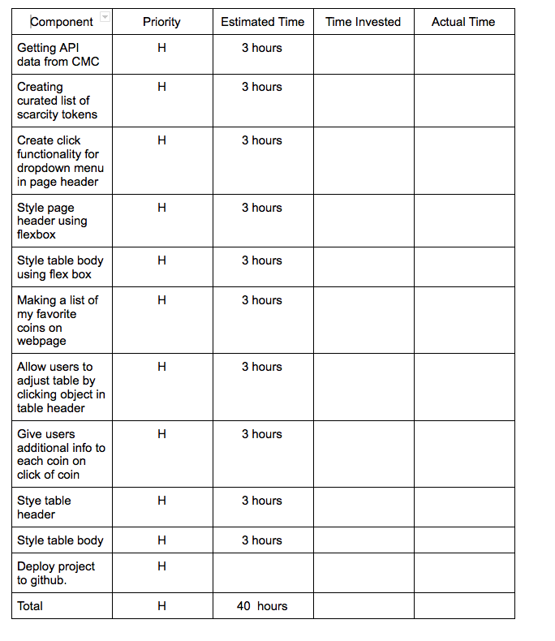
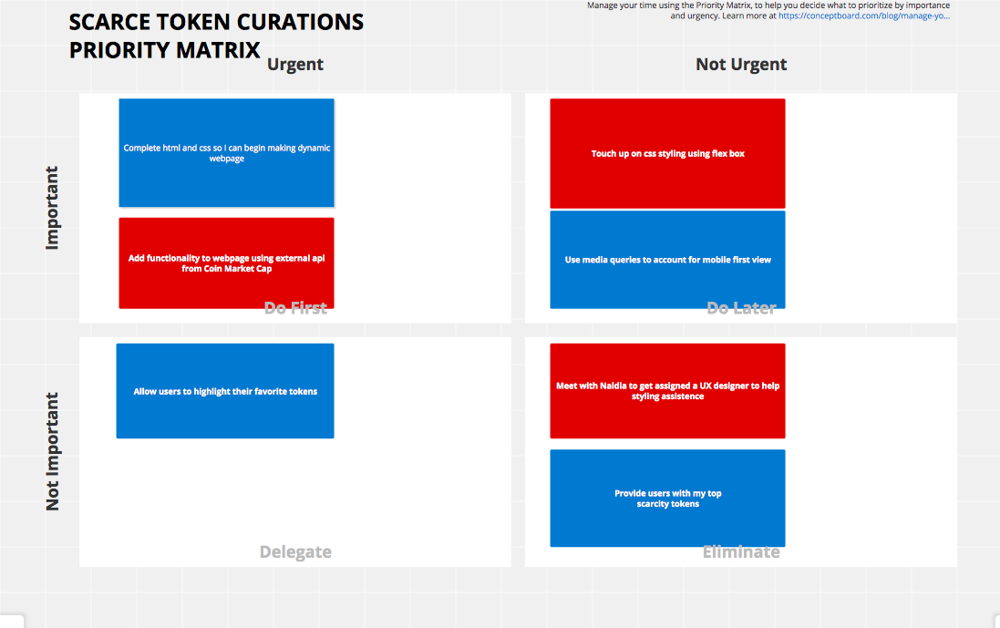
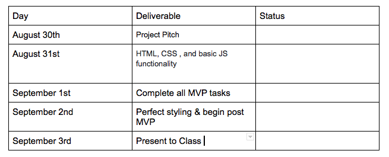

# Scarce-Coin-Curations
## Project Description

This app will provide digital asset investors with a focused list of cryto curriencies whose circulatiing supply is less than 100 million.

## API Sample 
 For this project I will utilize Coin Market Cap's API and, more specifically, their cryptocurrency/* endpoint to access information around cryptocurrencies such as ordered lists and volume data.

Bitcoin example  
```
{
      "id": 1,
      "name": "Bitcoin",
      "symbol": "BTC",
      "slug": "bitcoin",
      "num_market_pairs": 8858,
      "date_added": "2013-04-28T00:00:00.000Z",
      "max_supply": 21000000,
      "circulating_supply": 18802575,
      "total_supply": 18802575,
      "platform": null,
      "cmc_rank": 1,
      "last_updated": "2021-08-31T13:36:29.000Z",
      "quote": {
        "USD": {
          "price": 47765.48645352477,
          "volume_24h": 33513004644.55817,
          "percent_change_1h": -0.46474154,
          "percent_change_24h": 0.14617244,
          "percent_change_7d": -1.57905816,
          "percent_change_30d": 15.14020669,
          "percent_change_60d": 43.19822578,
          "percent_change_90d": 26.87439424,
          "market_cap": 898114141453.8834,
          "market_cap_dominance": 42.4971,
          "fully_diluted_market_cap": 1003075215524.02,
          "last_updated": "2021-08-31T13:36:29.000Z"
        }
      }
    },
    {
  ```

## Wireframe 
[Wireframe](https://whimsical.com/scarce-coin-curations-8Exmhe2QsSZ1VvwfedgKN7)


## MVP 
  - Format coins in ordered list 
  - Display data for each coin 
    - coin ranking
    - name 
    - price 
    - circulating supply 
    - total supply
    - market cap 
    - 30 day chart 
    - 90 day chart 
  - Create dropdown link to explain site 


## Post MVP 
- Provide users with my top 5 list of 'scarcity tokens'
- Present users added info on each coin when clicked 
  - exchange data 
  - white paper
  - protocol's website 
- Allow users to highlight favorite coins.
- Allow users to alter list. 

## Project Schedule 



 
## Priority matrix 



## Times Frames

